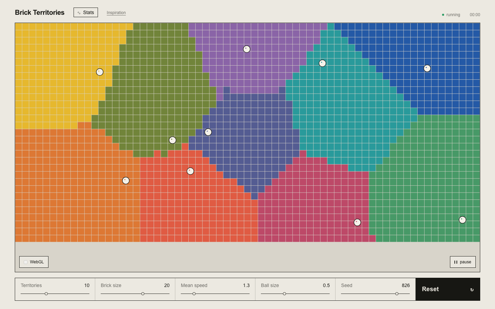

# Brick Territories

An animated territory simulation driven by bouncing balls. Each ball captures cells for its territory, moves at an individually sampled speed, and generates data for the visual and audio renderers.



## Features

- Smooth WebGL territories with animated frontiers
- Canvas brick renderer fallback
- Normally distributed ball speeds
- Hover details and area history
- Adjustable territory count, cell size, speed, ball size, and seed
- Eight simulation-driven audio modes

## Audio modes

- **Territory drones:** Area shares shape a spatial chord.
- **Capture bells:** Captures trigger pitched, positioned chimes.
- **Ball swarm:** Ball speed and position control individual voices.
- **Frontier wind:** Border complexity and conflict shape stereo noise.
- **Map pulse:** Leading territories form a changing rhythmic sequence.
- **Granular impacts:** Capture rate controls clipped percussion density, weight, and pitch.
- **Territory clouds:** Territory size forms slow octave layers; conflict adds bright, dense flares.
- **Map scrubber:** The song advances continuously while captures steer its speed, position, pitch, and slicing.

The granular modes include synth, piano, drums, rain, and a full vocal song. You can also load an audio file; it is decoded locally and never uploaded. Grains are shifted by exact octaves to preserve the source harmony. Bundled recording details are in [SOURCES.md](public/audio/SOURCES.md).

Audio starts after selecting a mode because browsers require user interaction.

## Run locally

```sh
npm install
npm run dev
```

Create a production build with `npm run build`.

## Publish to Hostr

```sh
HOSTR_TOKEN=your-token npm run publish
```

Pass an optional destination path with `npm run publish -- my-path`.

## Inspiration

Based on [jagarikin's original post](https://twitter.com/jagarikin/status/1388660839205326851).
